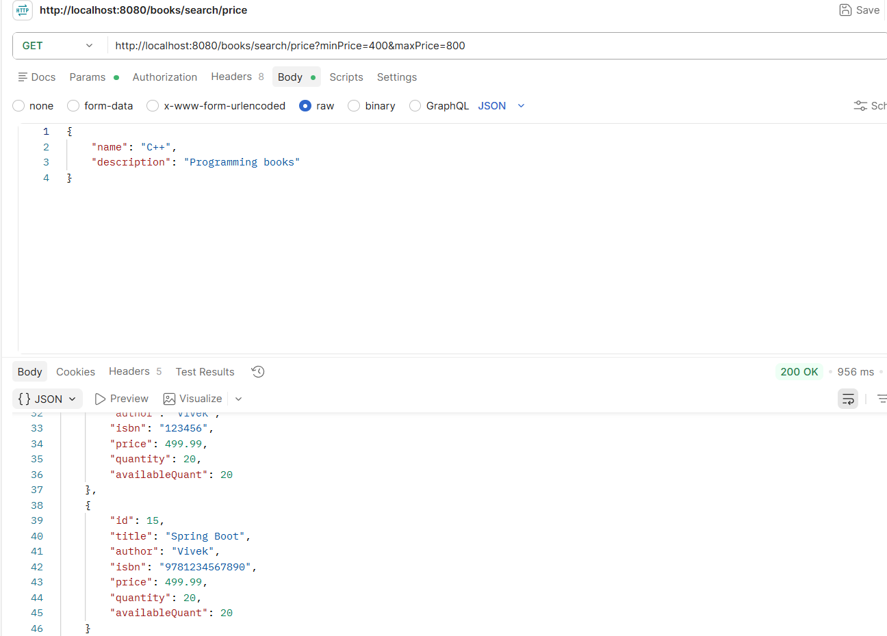
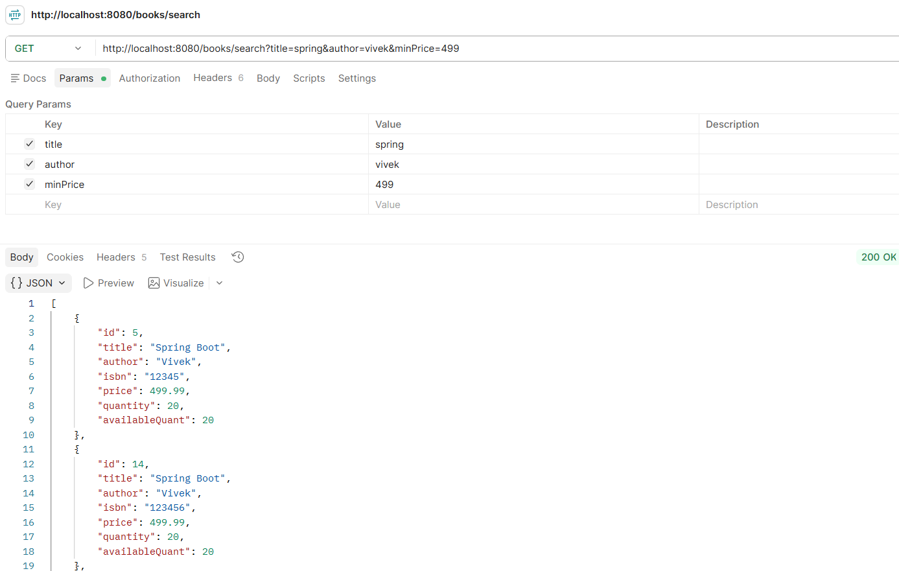

# Library Management System

## Overview

A RESTful Library Management System built using Spring Boot. The project demonstrates clean architecture with DTOs, layered design, validation, exception handling, and MySQL database integration.

## ✨ Features

### 📚 Book Management
- 📚 Book CRUD APIs
- 🗂️ Category CRUD APIs
- 🔗 Category-Book Relationship
- 📄 Request & Response DTOs
- ✅ Input Validation
- ⚠️ Global Exception Handling

### 🔍 Search & Filtering
- 📄 Pagination
- 🔃 Sorting
- 🔍 Search by Title
- 👤 Search by Title & Author
- 💰 Search by Price Range
- 🔍 Dynamic Search using Spring Data JPA Specifications

### 📖 Borrow & Return Management
- 📖 Borrow Books
- 🔄 Return Books
- 🚫 Prevent Duplicate Borrowing
- 📦 Inventory Management (Available Quantity Tracking)
- 📅 Automatic Due Date Calculation
- 📅 Return Date Tracking
- 🔄 Transaction Management using `@Transactional`
- ↩️ Automatic Rollback on Failure

### ⚙️ Backend
- 🗄️ Spring Data JPA & Hibernate
- 💾 MySQL Database Integration
- 📑 Swagger / OpenAPI Documentation

## Tech Stack

* Java 21
* Spring Boot
* Spring Data JPA
* Hibernate
* MySQL
* Maven
* Postman


## Project Structure

```
src
├── controller
├── service
├── repository
├── entity
├── dto
├── exception
└── config
```

## API Endpoints

### Book APIs

- GET `/books`
- GET `/books/{id}`
- POST `/books`
- PUT `/books/{id}`
- DELETE `/books/{id}`

### Search APIs

- GET `/books/search?title={title}`
- GET `/books/search?title={title}&author={author}`
- GET `/books/search/price?minPrice={minPrice}&maxPrice={maxPrice}`

### Category APIs

* GET /category
* GET /category/{id}
* POST /category
* PUT /category/{id}
* DELETE /category/{id}
* SEARCH /search/price

## Concepts Implemented

- Layered Architecture
- DTO Mapping
- Constructor Injection
- Validation
- Global Exception Handling
- Repository Pattern
- One-to-Many / Many-to-One Mapping
- Pagination
- Sorting
- Derived Query Methods
- Search APIs

# Screenshots

## Get All Books


## Book Table


## Category Created


## Category Updated


## Category Deleted


## Category Not Found


## Search by Price Range



## Dynamic Search 



## Future Improvements

* JWT Authentication
* Docker Support
* Unit Testing

## Author

**Vivek Chauhan**

- MCA Student at IIIT Bhopal
- Aspiring Backend Developer & Data Scientist
- Passionate about Java, Spring Boot, SQL, and DSA