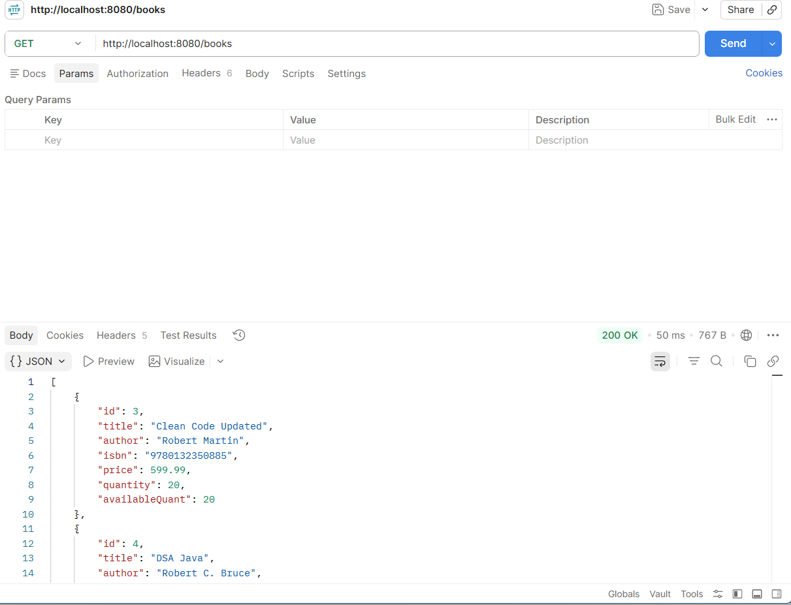
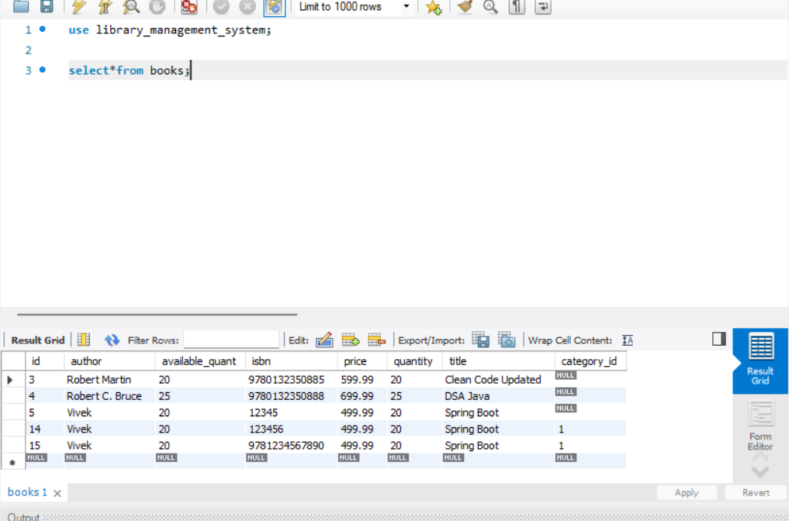
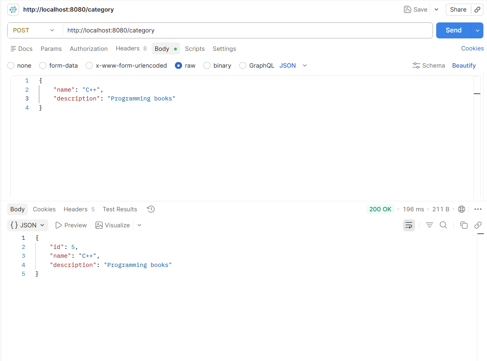
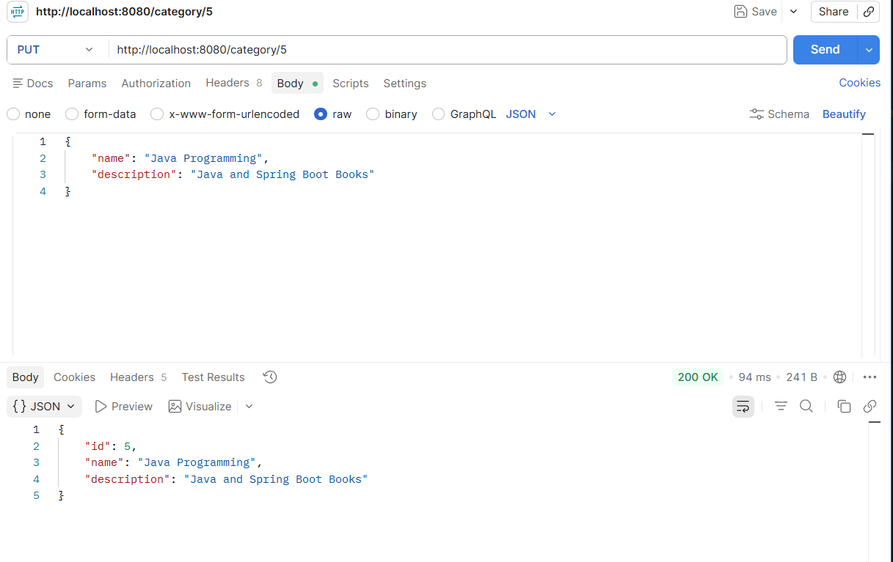
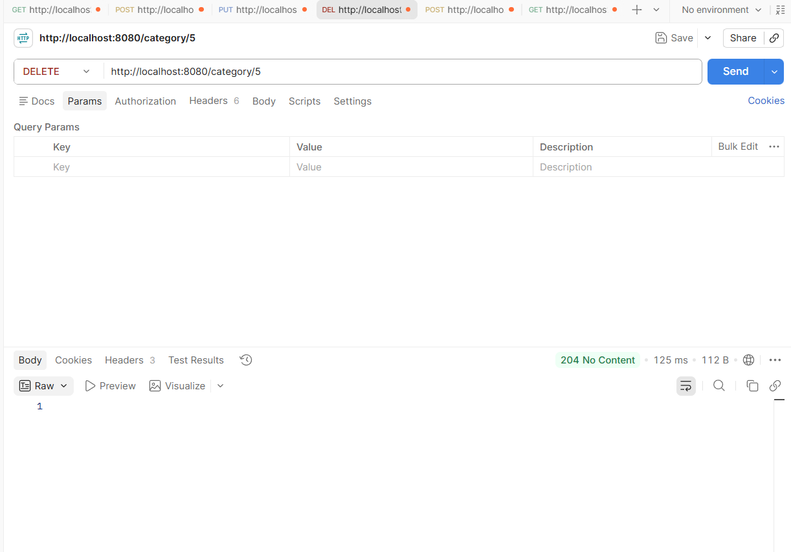
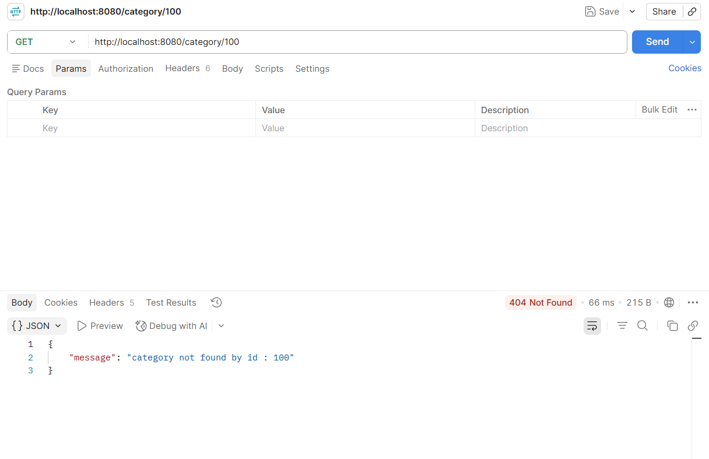

# Library Management System

## Overview

A RESTful Library Management System built using Spring Boot. The project demonstrates clean architecture with DTOs, layered design, validation, exception handling, and MySQL database integration.

## Features

* Book CRUD APIs
* Category CRUD APIs
* Request and Response DTOs
* Global Exception Handling
* Input Validation
* Category-Book Relationship
* Spring Data JPA & Hibernate
* MySQL Database
* Pagination & Sorting

## Tech Stack

* Java 21
* Spring Boot
* Spring Data JPA
* Hibernate
* MySQL
* Maven
* Postman


## Project Structure

```
src
├── controller
├── service
├── repository
├── entity
├── dto
├── exception
└── config
```

## API Endpoints

### Book APIs

* GET /books
* GET /books/{id}
* POST /books
* PUT /books/{id}
* DELETE /books/{id}

### Category APIs

* GET /category
* GET /category/{id}
* POST /category
* PUT /category/{id}
* DELETE /category/{id}

## Concepts Implemented

* Layered Architecture
* DTO Mapping
* Constructor Injection
* Validation
* Global Exception Handling
* Repository Pattern
* One-to-Many / Many-to-One Mapping

# Screenshots

## Get All Books



## Book Table



## Category Created



## Category Updated



## Category Deleted



## Category Not Found



## Future Improvements

* Search APIs
* Swagger Documentation
* JWT Authentication
* Docker Support
* Unit Testing

## Author

**Vivek Chauhan**

- MCA Student at IIIT Bhopal
- Aspiring Backend Developer & Data Scientist
- Passionate about Java, Spring Boot, SQL, and DSA